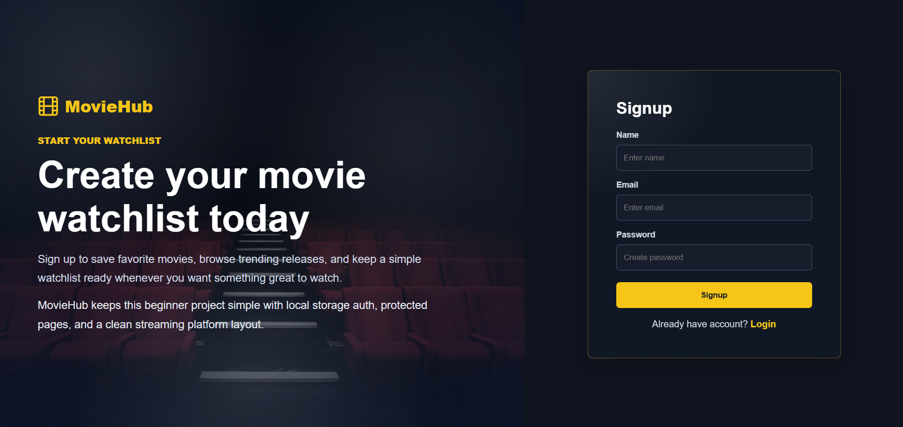
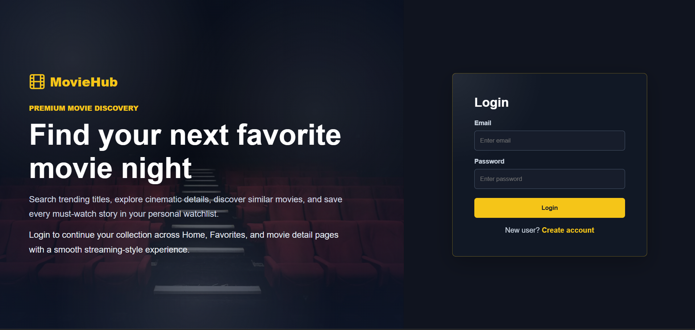
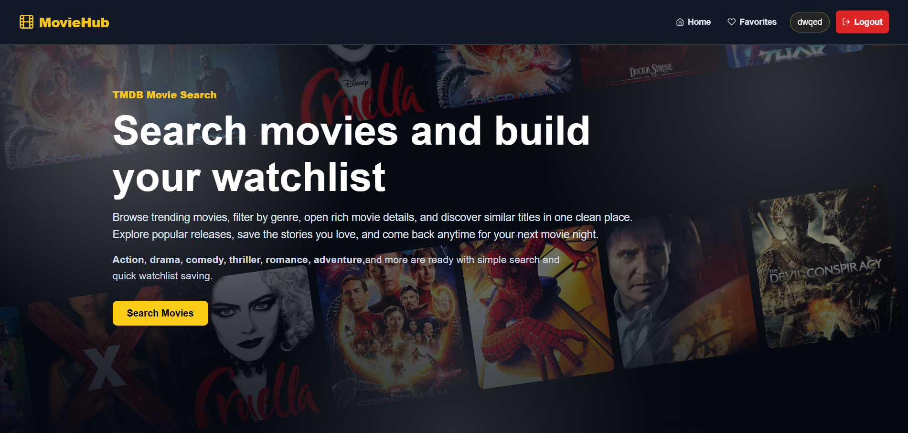
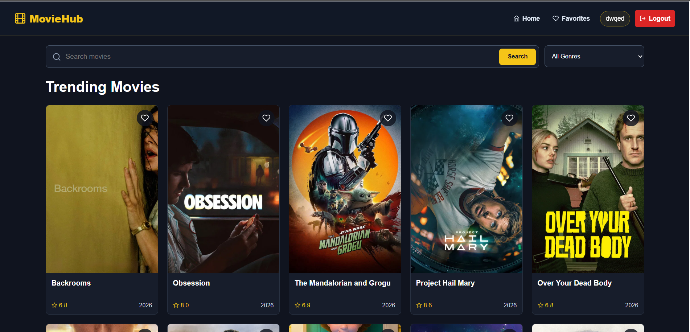
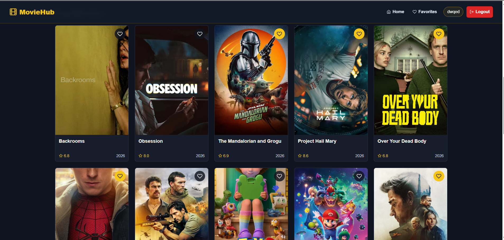
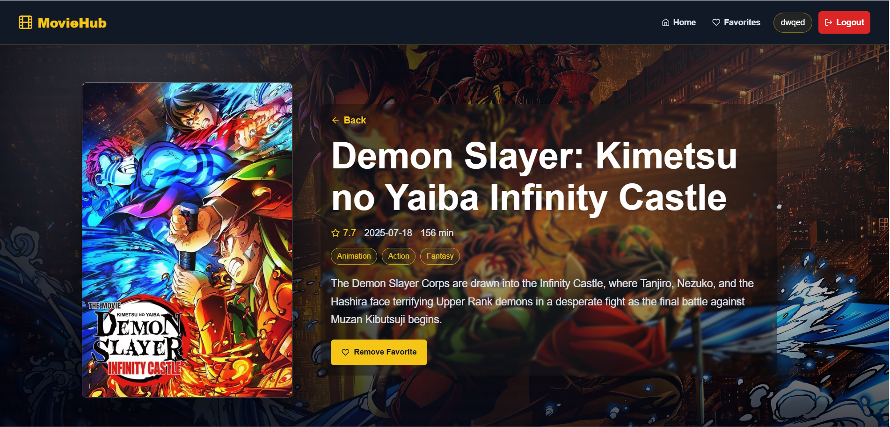
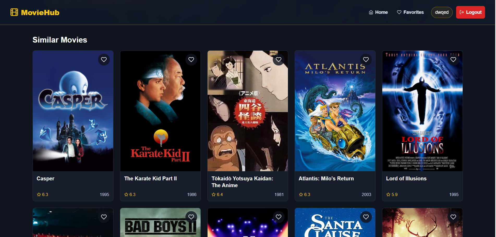
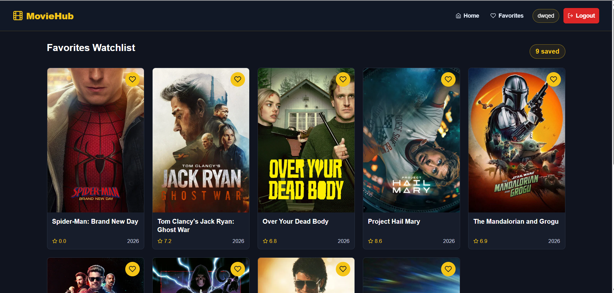
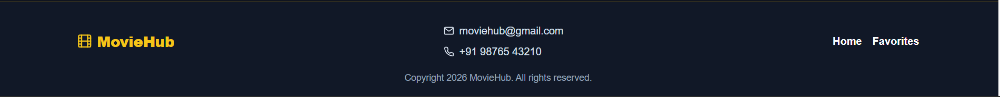
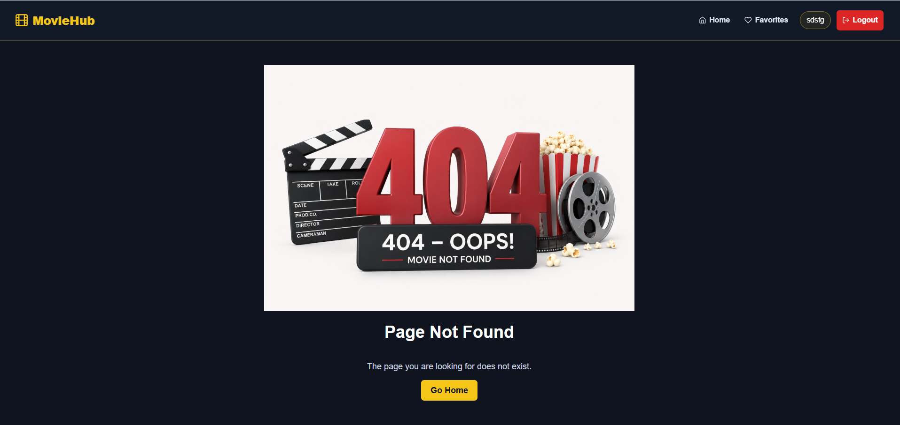

# 🎬 Movie Search App

A modern and responsive Movie Search Application built using **React JS** and **TMDB API**.  
This project allows users to search movies, explore trending films, and view movie details with a clean and professional UI.

---

# 🚀 Live Demo

```txt
Add your deployed project link here
```

# 📂 GitHub Repository

```txt
Add your GitHub repository link here
```

# 📌 Features

## 🔍 Movie Search

- Search movies dynamically using TMDB API
- Real-time search results
- Responsive movie cards

## 🎞 Trending Movies

- Display trending and popular movies
- Dynamic movie listings

## 📄 Movie Details

- Movie title
- Poster
- Ratings
- Release date
- Overview/description

## 📱 Responsive Design

- Mobile-first responsive layout
- Tablet and desktop support
- Responsive navbar
- Flexible card layouts using Flexbox/Grid

## 🎨 Clean UI/UX

- Modern color palette
- Professional typography
- Consistent spacing and alignment
- Attractive movie cards/buttons

## ✨ Animations & Interactions

- Hover effects
- Smooth transitions
- Loading states/skeletons
- Framer Motion animations

## ⚡ Performance Optimization

- Optimized images
- Lazy loading
- Efficient rendering
- Clean component structure

---

# 🛠️ Tech Stack

## Frontend

- React JS
- Vite
- JavaScript
- CSS / Tailwind CSS

## API

- TMDB API

## Libraries

- react
- react-dom
- react-icons
- react-router

---

| Technology         | Usage                        |
| ------------------ | ---------------------------- |
| React JS           | Frontend Framework           |
| React Router DOM   | Routing                      |
| Context API        | State Management             |
| Tailwind CSS / CSS | Styling                      |
| Axios / Fetch API  | API Requests                 |
| Framer Motion      | Animations                   |
| TMDB API           | Movies Data                  |
| LocalStorage       | Authentication & Persistence |

---

# 📂 Folder Structure

```bash
src/
 ├── components/
 ├── pages/
 ├── assets/
 ├── services/
 ├── hooks/
 ├── App.jsx
 └── main.jsx
```

---

# ⚙️ Installation & Setup

## 1️⃣ Clone Repository

```bash
git clone https://github.com/AllemSamyel-03/Movie-Search-Website.git
```

## 2️⃣ Navigate to Project

```bash
cd MovieSearchApp
```

## 3️⃣ Install Dependencies

```bash
npm install
```

## 4️⃣ Start Development Server

```bash
npm run dev
```

---

# 🔑 Environment Variables

Create a `.env` file in the root folder and add:

```env
VITE_TMDB_API_KEY=YOUR_API_KEY
```

---

# 🌐 TMDB API Setup

1. Create account at:
   https://www.themoviedb.org/

2. Generate API key

3. Add API key inside `.env`

---

# 📷 Screenshots

### 🔐 Login / Signup Page

---



---



---

### 🏠 Home Page

---



---



---



---

### 📄 Movies Details Page

---



---



---

### ❤️ Favorites Movies Page

---



---

### Footer Section

---



---

### Not Found Page

---



---

# 🚀 Deployment

Deploy using:

- Vercel
- Netlify

---

# 📈 Skills Demonstrated

- React Components
- React Hooks
- API Integration
- State Management
- Responsive Web Design
- UI/UX Design
- Performance Optimization
- Reusable Components

---

# 🎯 Future Improvements

- Authentication
- Favorites/Watchlist
- Dark Mode
- Infinite Scrolling
- Trailer Modal
- Genre Filtering

---

# 👨‍💻 Author

Developed by **ALLEM SAMYEL**

GitHub: https://github.com/AllemSamyel-03

Linkedin: https://www.linkedin.com/in/allem-samyel-039655374/

---

# 📄 License

This project is licensed under the MIT License.

# ⭐ Show Your Support

If you like this project, give it a ⭐ on GitHub.
